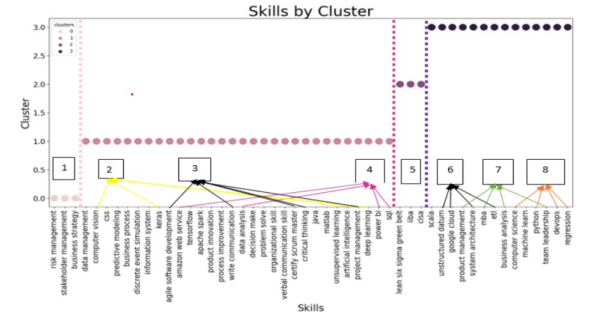

# Assignment 3

## Background

The purpose of this project is to create a course curriculum for a new "Master of Business and Management in Data Science and Artifical Intelligence". The job description from interested jobs was scrapped from Indeed and then clustering algorithms was used to group/segment skills into courses. To extract skills, the NLP model [**SkillNeER](https://github.com/AnasAito/SkillNER) was use to categorize the type of skills. The project consisted of the following five steps:

* Data collection and cleaning
* EDA and Feature Engineering
* Hierachical Clustering Implementation
* K-means clustering
* Interpretation of results 

## Results

After extracting the skils from Indeed, and applying EDA and feature engineering, the skills were grouped together using two methods. The Hierachical Clustering method and the K-means method. The results was the following:

  

From the results, two proposed course schedule was made for each individual algorithms and one trying to combine both algorithms.

  

## Initial Setup \ Dependencies

* Create a virtual environment
* Install libraries in Requirements
* The following JSON files are part of SkillNER. They were used to extract whether the skill is considered a soft skill,
hard skill, or Certification. 
	* skill_db_relax_20.json
	* token_dist.json

* webscraping_results_assignmnet3.csv is the results from the extracted skills from Indeed
* Run Assignment3 for step 2-4 of the project
